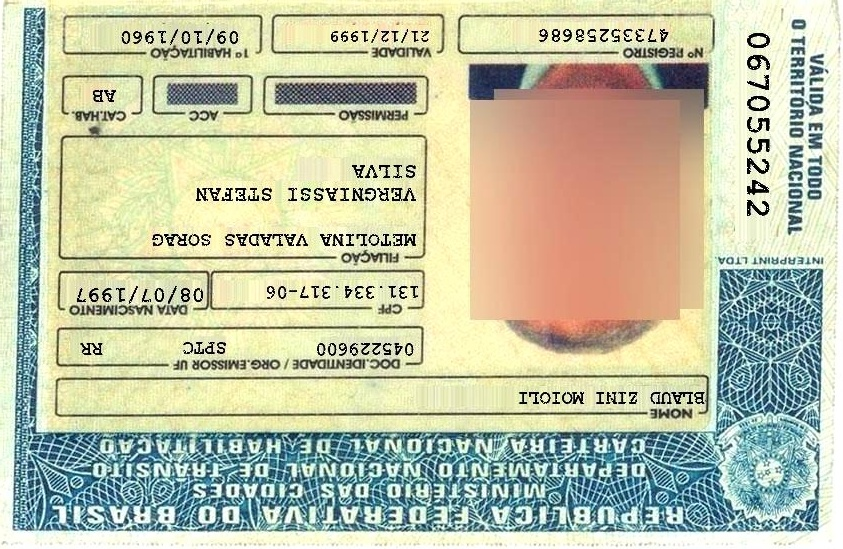
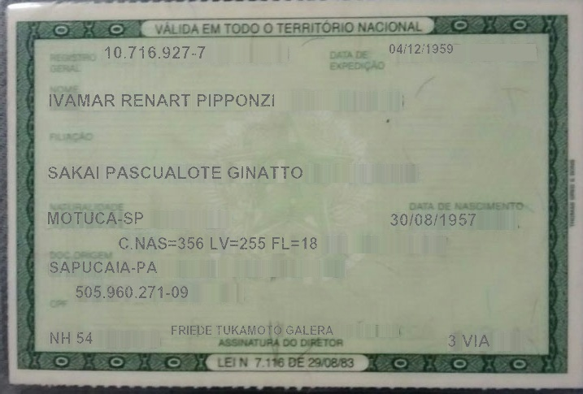
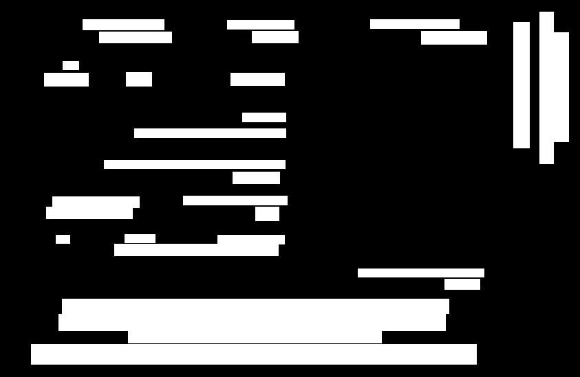
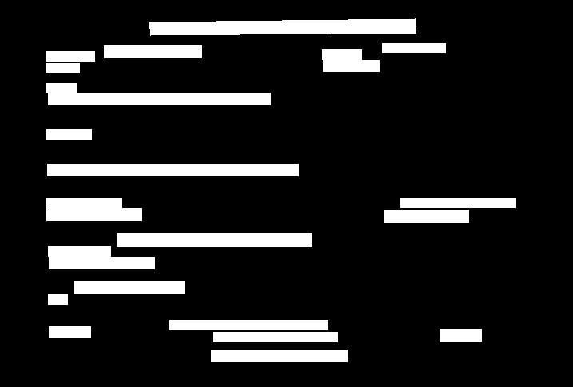
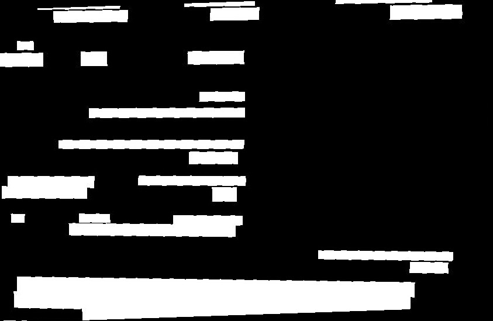
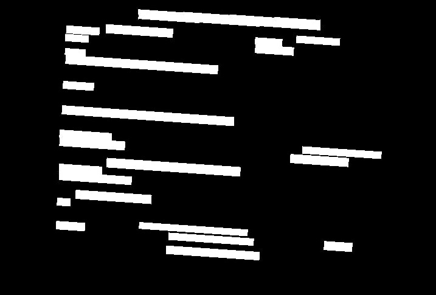

# Data Augmentation

Este diretório contém o subprojeto responsável por gerar um dataset aumentado de documentos brasileiros mantendo sincronizados três artefatos por amostra: imagem do documento, máscara associada e anotações OCR em texto.

De modo amplo é um data augmentation de imagens.

## Visão geral do projeto

O objetivo deste subprojeto é aumentar a diversidade visual de um dataset de documentos sem quebrar a correspondência entre imagem, máscara e caixas de texto (bounding box). Em vez de transformar apenas a imagem RGB, o pipeline aplica as mesmas transformações geométricas à máscara e às bounding boxes das anotações. Isso é essencial porque os artefatos gerados podem alimentar etapas posteriores do sistema:

- o classificador em `src/document_classifier/`, que consome principalmente as imagens `.jpg` por classe;
- a etapa de OCR/parsing em `src/ocr_parsing/`, que pode se beneficiar de imagens, anotações e cenários degradados para avaliação;
- rastreabilidade experimental por meio de manifests CSV/JSON que descrevem cada arquivo gerado.

### Input

As entradas esperadas são diretórios por classe contendo, para cada documento, exatamente uma anotação `.txt` e duas imagens: a imagem do documento e a máscara.

#### Exemplo de imagem real





#### Exemplo de mascara




#### Exemplo de anotação de bounding box

Informações textuais da CNH_Frente
```text
x, y, width, height, transcription
45, 501, 647, 29, REPÚBLICA FEDERATIVA DO BRASIL
186, 478, 368, 21, MINISTÉRIO DAS CIDADES
85, 457, 562, 24, DEPARTAMENTO NACIONAL DE TRÂNSITO
90, 435, 562, 21, CARTEIRA NACIONAL DE HABILITAÇÃO
646, 406, 51, 15, NOME
520, 391, 183, 12, BLAUD ZINI MOIOLI
166, 355, 238, 17, DOC. IDENTIDADE/ÓRG EMISSOR UF
316, 342, 97, 13, 045229600
181, 341, 44, 12, SPTC
81, 342, 20, 12, RR
371, 301, 34, 20, CPF
266, 285, 151, 13, 131.334.317-06
67, 301, 125, 17, DATA NASCIMENTO
76, 286, 126, 16, 08/07/1997
338, 250, 68, 17, FILIAÇÃO
151, 233, 263, 12, METOLINA VALADAS SORAG
195, 187, 220, 13, VERGNIASSI STEFAN
352, 164, 63, 13, SILVA
335, 106, 78, 18, PERMISSÃO
183, 105, 37, 20, ACC
64, 106, 64, 19, CAT. HAB.
91, 89, 23, 12, AB
144, 46, 105, 16, 1ª HABILITAÇÃO
120, 28, 118, 15, 09/10/1960
366, 45, 67, 17, VALIDADE
330, 29, 97, 13, 21/12/1999
538, 28, 129, 13, 47335258686
612, 45, 95, 19, Nº REGISTRO
746, 32, 23, 183, 067055242
805, 47, 21, 159, VÁLIDA EM TODO
784, 17, 20, 221, O TERRITÓRIO NACIONAL
```

Informações textuais da RG_Verso
```text
x, y, width, height, transcription
[519, 187, 188, 520], [23, 27, 44, 41], -1, -1, VÁLIDA EM TODO O TERRITÓRIO NACIONAL
478, 54, 79, 12, 04/12/1959
130, 57, 122, 15, 10.716.927-7
60, 116, 278, 15, IVAMAR RENART PIPPONZI
59, 205, 314, 15, SAKAI PASCUALOTE GINATTO
58, 261, 119, 15, MOTUCA-SP
146, 292, 244, 16, C.NAS=356 LV=255 FL=18
61, 322, 132, 14, SAPUCAIA-PA
93, 352, 138, 15, 505.960.271-09
61, 409, 52, 14, NH 54
212, 401, 198, 11, FRIEDE TUKAMOTO GALERA
264, 439, 170, 14, LEI Nº7 116 DE 29/08/83
267, 416, 155, 12, ASSINATURA DO DIRETOR
501, 248, 144, 12, DATA DE NASCIMENTO
404, 75, 70, 14, EXPEDIÇÃO
403, 62, 49, 12, DATA DE
551, 412, 51, 15, 3 VIA
58, 162, 56, 13, FILIAÇÃO
58, 64, 60, 13, REGISTRO
57, 79, 42, 12, GERAL
58, 104, 37, 11, NOME
60, 308, 78, 13, DOC ORIGEM
57, 248, 95, 13, NATURALIDADE
60, 368, 24, 13, CPF
480, 263, 106, 15, 30/08/1957
```

### Output

A saída é outro dataset por classe, com cópias opcionais dos originais e variantes sintéticas geradas por `Albumentations`.

Classes padrão no código:

```text
CNH_Frente
CNH_Verso
CPF_Frente
CPF_Verso
RG_Frente
RG_Verso
```

#### Exemplo de imagem real transformada


#### Exemplo de mascara transformada




#### Exemplo de json de descrição das transformações

Pedaço do json de transformação da imagen transformada da CNH_Frente
```json
{
  "class_name": "CNH_Frente",
  "document_id": "00003658",
  "variant_index": 1,
  "source_image": "BID_Sample_Dataset\\CNH_Frente\\00003658_in.jpg",
  "source_mask": "BID_Sample_Dataset\\CNH_Frente\\00003658_gt_segmentation.jpg",
  "source_annotation": "BID_Sample_Dataset\\CNH_Frente\\00003658_gt_ocr.txt",
  "output_image": "dataset_augmented\\CNH_Frente\\00003658__aug01.jpg",
  "output_mask": "dataset_augmented\\CNH_Frente\\00003658__aug01_mask.jpg",
  "output_annotation": "dataset_augmented\\CNH_Frente\\00003658__aug01.txt",
  "is_augmented": true,
  "scenario": "perspective_shadow",
  "seed": 3021627498,
  "original_width": 843,
  "original_height": 549,
  "output_width": 843,
  "output_height": 549,
  "source_boxes": 31,
  "output_boxes": 28,
  "transforms": [
    {
      "name": "Perspective",
      "params": {
        "p": 1.0,
        "border_mode": 0,
        "fill": [
          181.0,
          198.0,
          200.0
        ],
        "fill_mask": 0.0,
        "fit_output": false,
        ...
```

## Arquitetura geral

O pipeline é uma orquestração local, não uma biblioteca distribuível. A CLI (Command Line Interface - Interface de Linha de Comando) cria uma configuração Pydantic, a etapa de descoberta agrupa arquivos em trincas, o planejador escolhe cenários de augmentação e a camada de I/O grava imagens, máscaras, anotações e logs.

```text
dataset/
  <classe>/
    <documento>.jpg
    <documento>_mask.jpg
    <documento>.txt
        |
        v
+-----------------------+
| data_augmentation.cli |
+-----------------------+
        |
        v
+----------------------------+
| AugmentationConfig         |
| valida caminhos, classes,  |
| seed, fator, qualidade     |
+----------------------------+
        |
        v
+----------------------------+
| utils.discovery            |
| agrupa imagem + máscara +  |
| anotação em DocumentTriplet|
+----------------------------+
        |
        v
+----------------------------+
| planner                    |
| escolhe cenários em        |
| round-robin por classe     |
+----------------------------+
        |
        v
+-----------------------------+
| utils.transforms            |
| Albumentations ReplayCompose|
| imagem + máscara + bboxes   |
+-----------------------------+
        |
        v
+----------------------------+
| utils.io / pipeline        |
| grava dataset aumentado,   |
| sidecars e manifests       |
+----------------------------+
        |
        v
dataset_augmented/
  <classe>/
    <id>__orig.jpg
    <id>__orig_mask.jpg
    <id>__orig.txt
    <id>__orig.json
    <id>__aug01.jpg
    <id>__aug01_mask.jpg
    <id>__aug01.txt
    <id>__aug01.json
  logs/
    augmentation_log.jsonl
    mlflow_manifest.csv
    summary.csv
    mlflow_params.json
```

## Fluxo de execução ponta a ponta

1. O usuário executa `src/main_data-augmentation.py` ou chama a CLI.
2. `build_parser()` declara os argumentos de entrada, saída, seed, fator de augmentação, classes, qualidade JPEG, sobrescrita e limpeza de saída.
3. `main()` converte os argumentos em `AugmentationConfig`.
4. `run_augmentation()` cria `output_dir` e `log_dir`; se `--clean-output` for usado, chama `_clean_output_dir()` antes da geração.
5. `discover_triplets()` percorre cada pasta de classe configurada e agrupa arquivos por identificador de documento.
6. Cada grupo precisa ter uma anotação `.txt` e duas imagens. Se a máscara não for clara pelo nome, `_mask_likeness_score()` usa uma heurística visual para escolher a imagem mais parecida com máscara.
7. Se `copy_originals=True`, `_copy_original_if_needed()` copia imagem, máscara e anotação original para a saída com sufixo `__orig`.
8. Para cada variante sintética, `scenario_for_index()` escolhe um cenário em round-robin por classe.
9. `_variant_seed()` deriva uma seed determinística baseada em seed base, classe, documento e índice da variante.
10. `_augment_triplet()` lê imagem, máscara e anotações, constrói a composição Albumentations do cenário, aplica a transformação sincronizada e grava os artefatos.
11. Ao final, `write_jsonl()`, `write_manifest_csv()`, `write_summary_csv()` e `write_params_json()` consolidam os logs da execução.

O pipeline falha explicitamente se nenhuma trinca válida for encontrada ou se arquivos de saída já existirem e `--overwrite` não tiver sido informado.

## Estrutura de pastas e arquivos

```text
src/data_augmentation/
  cli.py
  config.py
  models.py
  pipeline.py
  planner.py
  readme.md
  utils/
    __init__.py
    discovery.py
    io.py
    transforms.py
```

## Estrutura do Dataset

Por padrão, a CLI espera:

```text
dataset/
   CNH_Frente
   CNH_Verso
   CPF_Frente
   CPF_Verso
   RG_Frente
   RG_Verso
```

Cada documento deve formar uma trinca:

```text
<id>.jpg ou <id>.png
<id>_mask.jpg ou variação equivalente
<id>.txt
```

O agrupamento é tolerante a sufixos como `mask`, `mascara`, `bbox`, `gt`, `segmentation`, `image`, `img`, `documento`, `original` e similares. Esses sufixos são removidos por `_document_key()` para derivar o `document_id` comum.

A anotação `.txt` pode estar em formato CSV canônico:

```text
x,y,width,height,transcription
10,20,100,30,NOME
```

Também há suporte a linhas poligonais do tipo BID, em que coordenadas x/y aparecem como listas. Nesse caso, o código converte o polígono em uma caixa retangular mínima.

## Pasta Padrão de saída

A pasta padrão de saída é `./dataset_augmented/`. Para cada classe, o pipeline grava:

- imagem original copiada, quando `copy_originals=True`;
- máscara original copiada, quando `copy_originals=True`;
- anotação original copiada, quando `copy_originals=True`;
- JSON sidecar por amostra original;
- imagem aumentada;
- máscara aumentada;
- anotação aumentada;
- JSON sidecar por variante aumentada.

Os logs ficam em `./dataset_augmented/logs/`:

- `augmentation_log.jsonl`: uma linha JSON por `AugmentationResult`;
- `mlflow_manifest.csv`: manifesto tabular amigável para registro no MLflow por outras etapas;
- `summary.csv`: contagens por classe, cenário e indicador de augmentação;
- `mlflow_params.json`: parâmetros de execução, quantidade de documentos encontrados e registros gravados.

Apesar do nome `mlflow_manifest.csv`, este subprojeto não chama a API do MLflow diretamente por não realiza treinamento. Ele apenas gera artefatos que podem ser logados por outro processo, como o treinamento do classificador.

## Explicação dos arquivos Python

### `cli.py`

Define a interface de linha de comando do subprojeto.

- `build_parser()`: cria o parser `argparse` com argumentos como `--dataset`, `--output`, `--seed`, `--total-factor`, `--classes`, `--overwrite`, `--clean-output` e `--no-copy-originals`.
- `main()`: lê os argumentos, instancia `AugmentationConfig`, executa `run_augmentation()` e imprime um resumo com quantidade de originais, aumentados e registros totais.

### `config.py`

Centraliza defaults e validação de configuração.

- `DEFAULT_CLASSES`: tupla com as classes processadas por padrão.
- `AugmentationConfig`: modelo Pydantic que valida caminhos, classes, seed, fator de augmentação, qualidade JPEG, limite de documentos por classe, extensões aceitas, nome da pasta de logs e tamanho mínimo de bounding boxes.
- `normalize_path()`: converte strings e objetos path-like em `Path`.
- `normalize_extensions()`: normaliza extensões para minúsculas e com ponto inicial.
- `variants_per_document`: propriedade que retorna `total_factor`.
- `log_dir`: propriedade que retorna `output_dir / log_dir_name`.

### `models.py`

Contém modelos Pydantic de dados transportados pelo pipeline.

- `TextBox`: representa uma caixa OCR com `x`, `y`, `width`, `height` e `transcription`.
- `TextBox.corners()`: retorna os quatro cantos da caixa em ordem horária.
- `DocumentTriplet`: reúne os caminhos de imagem, máscara e anotação de um documento fonte.
- `TransformRecord`: descreve uma transformação aplicada, seus parâmetros serializáveis e alvos afetados.
- `AugmentationResult`: registro completo de saída, incluindo origem, destino, classe, variante, dimensões, contagem de caixas e transformações aplicadas.

### `pipeline.py`

É o orquestrador principal.

- `run_augmentation()`: executa a descoberta, cópia de originais, geração de variantes e escrita dos manifests.
- `_copy_original_if_needed()`: copia a trinca original e gera um `AugmentationResult` com cenário `original`.
- `_clean_output_dir()`: remove a saída antes da execução, com proteções para não apagar a raiz do dataset, a raiz do projeto, a raiz do disco ou caminhos fora do projeto.
- `_augment_triplet()`: aplica uma variante sintética a uma trinca, salva imagem/máscara/anotação e cria o sidecar JSON.
- `_output_paths()`: monta nomes como `<document_id>__orig.jpg` e `<document_id>__aug01_mask.jpg`.
- `_ensure_can_write()`: bloqueia sobrescrita quando `overwrite=False`.
- `_variant_seed()`: implementa uma derivação determinística de seed no estilo FNV para cada variante.

### `planner.py`

Define o catálogo de cenários de augmentação.

- `AugmentationScenario`: dataclass imutável com `name` e função `build`.
- `build_scenarios()`: retorna seis cenários em ordem fixa.
- `scenario_for_index()`: seleciona cenário por `index % len(scenarios)`, permitindo round-robin.
- `_phone_tilt_color_background()`: rotação leve, escala/translação, fundo colorido, brilho/contraste, variação HSV e sombras.
- `_perspective_shadow()`: perspectiva, pequena rotação/escala/translação, sombra e ajuste de brilho/contraste.
- `_low_light_blur()`: baixa iluminação, blur gaussiano/movimento/desfoque e sombra.
- `_noise_jpeg()`: ruído gaussiano, brilho/contraste e compressão JPEG.
- `_strong_skew_color_background()`: perspectiva mais forte, inclinação, cor e contraste.
- `_multi_degradation()`: cenário composto com perspectiva, affine, sombras, blur opcional, ruído e compressão.

### `utils/discovery.py`

Descobre trincas válidas no dataset.

- `discover_triplets()`: percorre classes configuradas e aplica limite opcional por classe.
- `_discover_class_triplets()`: agrupa arquivos por documento e exige uma anotação e duas imagens por grupo.
- `_document_key()`: remove sufixos conhecidos para encontrar o identificador compartilhado.
- `_select_mask()`: escolhe a máscara por tokens no nome ou por heurística visual.
- `_contains_any()`: verifica presença de tokens em nomes.
- `_mask_likeness_score()`: lê uma imagem em escala de cinza, reduz para `128x128` e pontua o quanto ela parece binária.

### `utils/io.py`

Implementa leitura, escrita e serialização.

- `read_image()`: lê imagem colorida BGR com OpenCV.
- `read_mask()`: lê máscara em escala de cinza.
- `save_image()` e `save_mask()`: gravam imagens criando diretórios automaticamente.
- `copy_file()`: copia arquivos preservando metadados via `shutil.copy2`.
- `parse_annotations()`: transforma linhas de anotação em `TextBox`.
- `_read_text_with_fallback()`: tenta `utf-8-sig`, `cp1252` e `latin-1`.
- `write_annotations()`: grava CSV canônico `x,y,width,height,transcription`.
- `write_jsonl()`: grava registros em JSON Lines.
- `write_sidecar_json()`: grava JSON por amostra gerada.
- `write_manifest_csv()`: grava manifesto com colunas de classe, paths, cenário, seed e transformações.
- `write_summary_csv()`: agrega contagens por classe/cenário.
- `write_params_json()`: grava parâmetros da execução.
- `_parse_annotation_line()`: entende tanto CSV retangular quanto linhas poligonais.
- `_imread()` e `_imwrite()`: usam `np.fromfile`/`tofile` para lidar melhor com caminhos Windows não ASCII.

### `utils/transforms.py`

Concentra integração com Albumentations.

- `AugmentedSample`: dataclass com imagem, máscara, caixas transformadas e registros de replay.
- `colored_background()`: sorteia uma cor BGR de preenchimento.
- `apply_replay_compose()`: aplica `ReplayCompose` a imagem, máscara e bboxes com seed fixa.
- `make_replay_compose()`: cria `ReplayCompose` com `BboxParams` em formato Pascal VOC, clipping e filtro de caixas pequenas.
- `affine()`: constrói transformação affine sincronizada.
- `perspective()`: constrói transformação de perspectiva sincronizada.
- `replay_records_as_json()`: serializa `TransformRecord` em JSON.
- `_to_pascal_voc()` e `_from_pascal_voc()`: convertem entre `TextBox` e coordenadas Pascal VOC.
- `_replay_to_records()` e `_collect_records()`: extraem do replay apenas transformações aplicadas.
- `_applied_targets()`: classifica transformações geométricas como aplicadas a imagem, máscara e anotações.
- `_jsonable()`: transforma objetos NumPy e estruturas aninhadas em dados serializáveis.

## Pré-processamento de imagens e augmentations

Este subprojeto não faz uma etapa clássica de pré-processamento antes da geração, como binarização, retificação ou normalização global. O que existe é:

- leitura da imagem como BGR;
- leitura da máscara como escala de cinza;
- conversão das caixas OCR para Pascal VOC antes da transformação;
- eventual resize para `128x128` apenas dentro da heurística de identificação de máscara, não como parte da imagem gerada;
- aplicação de transformações Albumentations sincronizadas.

As transformações geométricas usam `cv2.INTER_LINEAR` para imagem e `cv2.INTER_NEAREST` para máscara. Essa decisão preserva melhor a natureza discreta da máscara, evitando valores intermediários artificiais.

As principais famílias de augmentação são:

- affine: rotação, escala, translação e shear;
- perspectiva: simula captura inclinada ou documento fotografado fora do eixo;
- brilho/contraste: simula iluminação variável;
- Hue/Saturation/Value: altera levemente tonalidade e saturação;
- sombras: simula interferências de captura com celular;
- blur: simula movimento, foco imperfeito ou desfoque gaussiano;
- ruído gaussiano: simula sensor/ambiente;
- compressão JPEG: simula perda por reenvio, câmera ou aplicativos.

Bounding boxes pequenas podem ser removidas após transformações por `min_bbox_size`, evitando anotações degeneradas.

## Decisões de projeto e justificativas

- Albumentations com `ReplayCompose`: permite aplicar e registrar transformações, garantindo sincronismo entre imagem, máscara e caixas.
- Round-robin de cenários por classe: distribui cenários de forma balanceada dentro de cada classe, evitando que uma classe receba apenas um tipo de degradação.
- Seed determinística por variante: melhora reprodutibilidade sem repetir exatamente a mesma transformação em todos os documentos.
- Sidecar JSON por amostra: facilita auditoria granular sem depender apenas do manifesto consolidado.
- Proteções em `--clean-output`: reduzem risco de apagar diretórios importantes durante testes locais.
- Heurística de máscara: torna a descoberta mais tolerante a nomes variados de arquivos, mas ainda falha explicitamente quando a trinca está incompleta.
- Pydantic para configuração e modelos: valida tipos e limites de forma declarativa, mas mantém o projeto simples e local.

Trade-offs:

- O pipeline assume que cada documento tem exatamente duas imagens e um `.txt`; datasets com múltiplas máscaras ou múltiplas versões precisam ser reorganizados antes.
- A escolha de máscara por heurística pode errar em casos extremos, por exemplo imagem original muito binária ou máscara colorida.

## Métricas, avaliação e artefatos

Este subprojeto não treina modelo e não calcula métricas de qualidade de ML. A avaliação aqui é operacional e de rastreabilidade:

- quantidade de registros gravados;
- quantidade de documentos encontrados;
- contagem por classe, cenário e indicador `is_augmented`;
- número de caixas na origem e na saída;
- transformações aplicadas e parâmetros serializados;
- dimensões antes e depois.

O arquivo `mlflow_manifest.csv` contém colunas úteis para etapas posteriores registrarem o dataset no MLflow. O treinamento do classificador, por exemplo, pode logar esse manifesto se ele existir.

## Execução local

Pré-requisitos principais:

- Python `>=3.10,<3.14`;
- dependências de `requirements.txt` ou `pyproject.toml`;
- OpenCV headless;
- Albumentations;
- Pydantic.

Instalação típica no Windows PowerShell:

```powershell
python -m venv .venv
.\.venv\Scripts\Activate.ps1
pip install --upgrade pip
pip install -r requirements.txt
```

Execução padrão:

```powershell
python src\main_data-augmentation.py `
  --dataset dataset `
  --output dataset_augmented `
  --total-factor 1 `
  --seed 42
  --classes CNH_Frente CNH_Verso RG_Frente RG_Verso CPF_Frente CPF_Verso
  --overwrite
```
classes as 6 apresentadas são default.
overwrite reescreve a imagem original.

## Docker, compose e YAML

Na raiz do workspace existem `Dockerfile`, `docker-compose.yml`, `requirements.txt` e `pyproject.toml`.

Arquivos de configuração relacionados:

- `requirements.txt`: lista as dependências instaladas pela imagem Docker e pela instalação local via `pip`; para este subprojeto, os pacotes mais relevantes são `albumentations`, `opencv-python-headless`, `numpy`, `pandas` e `pydantic`.
- `pyproject.toml`: declara metadados do projeto, versão de Python suportada (`>=3.10,<3.14`), dependências principais, dependências opcionais de desenvolvimento e configuração do Ruff. O campo `package-mode = false` indica que o workspace não está sendo tratado como pacote distribuível Poetry.
- `poetry.lock`: registra versões resolvidas pelo Poetry quando esse fluxo é usado. O pipeline não depende diretamente do lock em tempo de execução, mas ele ajuda a reproduzir ambiente.
- `.dockerignore`: exclui `.venv/`, `__pycache__/`, arquivos `.pyc`, `mlruns/`, `mlartifacts/`, `artifacts/`, `dataset_augmented/`, `BID_Sample_Dataset/` e `.git/` do contexto Docker, reduzindo tamanho e evitando levar artefatos locais para a imagem.
- `docker-compose.yml`: é o YAML de orquestração local. Ele não define serviço específico de augmentação, mas define infraestrutura compartilhada por outras etapas.
- `Dockerfile`: cria a imagem base do projeto.

O `Dockerfile`:

- usa `python:3.12-slim`;
- instala bibliotecas de sistema necessárias;
- instala dependências de `requirements.txt`;
- copia o workspace para `/app`;

O serviço de Docker Compose não define um serviço específico para `data_augmentation`. Portanto, para este subprojeto há duas opções:

1. executar localmente com Python/venv;
2. usar a imagem Docker manualmente, sobrescrevendo o comando.

Exemplo manual:

```shell
docker build -t docket-documents .
docker run --rm -v ${PWD}:/app docket-documents `
  python src/main_data-augmentation.py `
  --dataset dataset `
  --output dataset_augmented `
  --total-factor 1 `
  --seed 42
  --classes CNH_Frente CNH_Verso RG_Frente RG_Verso CPF_Frente CPF_Verso
  --overwrite
```

O projeto foi desenvolvido em ambiente Windows e testado/operacionalizado com Docker para reduzir diferenças de ambiente, especialmente em dependências nativas como OpenCV. No caso específico de augmentação, Tesseract não é usado, mas está presente na imagem porque a mesma base Docker atende também o OCR/parsing.

## Ambiente e portabilidade

O código usa `Path`, leitura via `np.fromfile` e escrita via `encoded.tofile`, o que ajuda em caminhos Windows com caracteres não ASCII. A imagem Docker melhora portabilidade para ambientes Linux, CI local e máquinas onde instalar dependências nativas manualmente seria mais trabalhoso.

Pontos de atenção:

- caminhos montados no Docker precisam existir no host;
- `--clean-output` só permite limpeza dentro da raiz do projeto atual;
- em ambientes diferentes, a ordenação de arquivos tende a permanecer estável porque o código usa `sorted()` em pontos relevantes.

## Limitações do processo

- Não há validação semântica das transcrições OCR; o pipeline apenas transforma coordenadas e preserva texto.
- Não há inspeção visual automática para confirmar se a augmentação continua realista.
- A heurística de seleção de máscara pode errar quando nomes são ambíguos e as imagens têm características incomuns.
- Transformações fortes podem remover ou distorcer caixas pequenas, especialmente se `min_bbox_size` for alto para o dataset.
- O pipeline espera uma organização rígida por classe.
- Não há execução paralela; datasets grandes podem demorar.
- Não há deduplicação entre execuções sem `--overwrite`; arquivos existentes bloqueiam a escrita.

## Melhorias futuras

- Adicionar validação visual amostral com painéis antes/depois.
- Gerar estatísticas de distribuição por cenário, dimensão e retenção de boxes.
- Permitir múltiplas máscaras ou múltiplos arquivos de anotação por documento.
- Suportar configuração externa YAML para cenários e probabilidades.
- Adicionar opção para forçar saída de máscaras em PNG ou JPG.
- Paralelizar por documento com cuidado para manter logs determinísticos.
- Integrar logging direto ao MLflow de forma opcional.
- Adicionar testes unitários para descoberta de trincas e parsing de anotações.
- Criar modo dry-run que apenas lista trincas e possíveis problemas.

## Padrões de projeto e boas práticas

- Separação clara entre CLI, configuração, modelos, descoberta, transformação e I/O.
- Uso de modelos Pydantic para dados persistidos e configuração.
- Docstrings em estilo Google em módulos, classes e funções.
- Funções privadas para detalhes de implementação, como `_variant_seed()` e `_parse_annotation_line()`.
- Escrita de artefatos auditáveis em JSON, CSV e JSONL.
- Tratamento explícito de erros para dataset inexistente, trincas inválidas e sobrescrita.
- Reprodutibilidade por seed base e seed derivada por variante.
- Uso de `ReplayCompose` para rastrear transformações aplicadas.

## Relação com os outros subprojetos

O resultado principal deste subprojeto é consumido pelo classificador. O classificador ignora máscaras, `.txt` e `.json`, usando apenas imagens `.jpg` que não terminam em `_mask.jpg`. Já o OCR/parsing pode usar imagens e ground truths pareados para avaliação em lote.

Fluxo macro:

```text
data_augmentation -> document_classifier -> ocr_parsing
```

## Autor

**Lucas Victor Silva Pereira**
[lucasvsilvap@gmail.com](mailto:lucasvsilvap@gmail.com)

## Licença

Este projeto está disponível para uso, estudo, modificação e adaptação para fins:

- acadêmicos
- educacionais
- pessoais
- institucionais não comerciais

Este projeto é licenciado sob a licença Creative Commons Attribution-NonCommercial 4.0 (**CC BY-NC 4.0**).

Não é permitido o uso comercial deste projeto ou de partes dele sem autorização prévia do autor.
