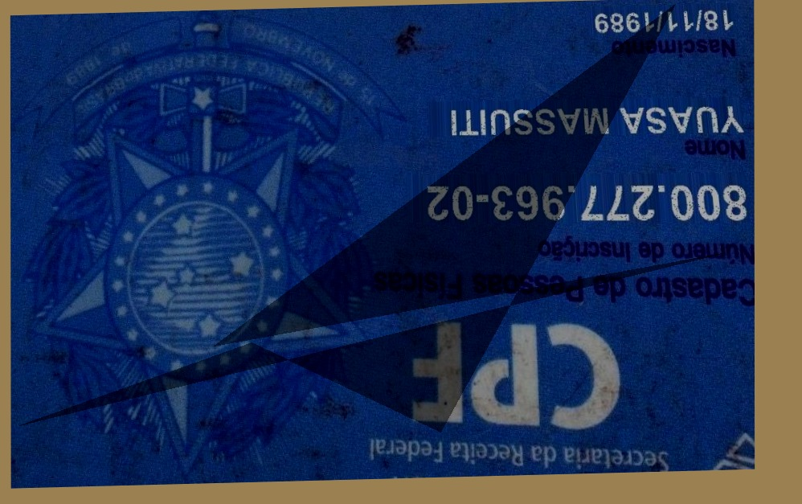
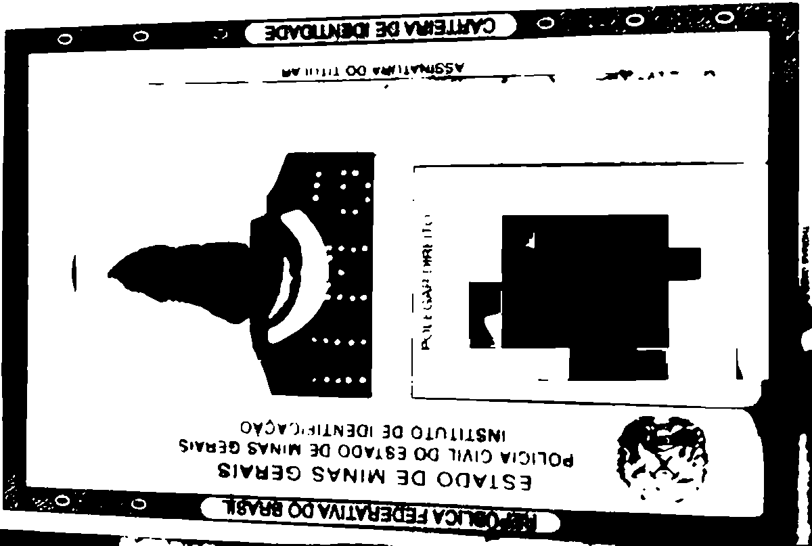
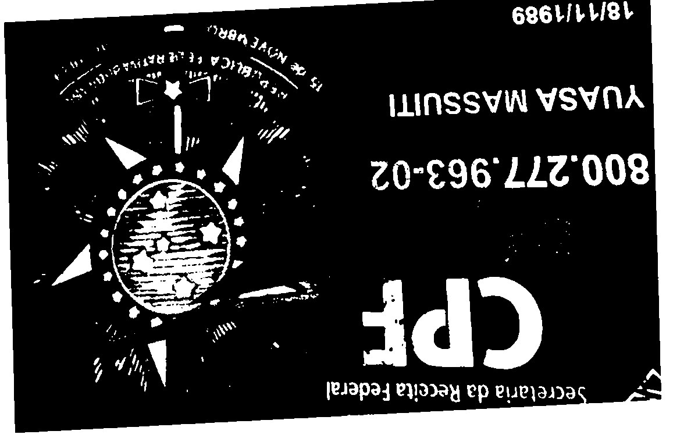

# OCR + Parsing

Este diretório contém o subprojeto responsável por retificar imagens de documentos, preparar a imagem para OCR, executar Tesseract, extrair campos estruturados por regras e avaliar os resultados contra ground truth textual.

Obs.: A validação é feita via *distância de levenshtein* de forma automatica, o que leva a uma sub acurácia do modelo, visto que qualquer caractere diferente acarreta em desigualdade de strings.

## Visão geral do projeto

O `OCR/parsing\` é a etapa posterior à classificação. Ele não decide o tipo do documento; recebe uma imagem e um `document_type` já conhecido, como `CNH_Frente` ou `CPF_Verso`. Com essa informação, aplica regras específicas para extrair campos esperados de cada tipo/lado de documento.

Problema resolvido:

- receber uma imagem possivelmente capturada com inclinação, ruído ou baixa qualidade;
- tentar retificar e melhorar a legibilidade;
- executar OCR com Tesseract;
- transformar texto OCR em campos estruturados;
- gerar JSON final auditável;
- em lote, comparar campos extraídos com anotações ground truth e consolidar métricas.

Entradas:

- imagem de documento;
- tipo conhecido do documento;
- opcionalmente, dataset com subpastas por tipo para execução em lote;
- ground truth `.txt` pareado com imagens para avaliação.

Saídas:

- imagem retificada;
- imagem pré-processada para OCR;
- texto OCR completo;
- JSON OCR detalhado por linha/palavra;
- JSON final com campos, avisos, qualidade e timings;
- relatórios consolidados em execução batch.

Tipos válidos:

```text
CNH_Frente
CNH_Verso
RG_Frente
RG_Verso
CPF_Frente
CPF_Verso
```

## Input

Imagem que passara pelo processo de OCR + Parsing:




## Output






Além de arquivo \*.json detalhado com todas as informações de OCR + Parsing.

parte do arquivo json
```json
{
  "tipo_documento": "CNH_Frente",
  "imagem_entrada": "/app/ocr_batch_dataset/CNH_Frente/00003658__orig.jpg",
  "artefatos": {
    "diretorio_execucao": "/app/artifacts/ocr_parsing_batch/por_imagem/00003658__orig_cnh_frente",
    "imagem_retificada": "/app/artifacts/ocr_parsing_batch/por_imagem/00003658__orig_cnh_frente/00003658__orig_cnh_frente_retificada.jpg",
    "imagem_pre_processada_ocr": "/app/artifacts/ocr_parsing_batch/por_imagem/00003658__orig_cnh_frente/00003658__orig_cnh_frente_pre_ocr.png",
    "texto_ocr": "/app/artifacts/ocr_parsing_batch/por_imagem/00003658__orig_cnh_frente/00003658__orig_cnh_frente_ocr.txt",
    "ocr_detalhado": "/app/artifacts/ocr_parsing_batch/por_imagem/00003658__orig_cnh_frente/00003658__orig_cnh_frente_ocr_detalhado.json",
    "json_resultado": "/app/artifacts/ocr_parsing_batch/por_imagem/00003658__orig_cnh_frente/00003658__orig_cnh_frente_resultado.json"
  },
  "qualidade_por_campo": {
    "filiacao": {
      "ocr_confidence": null,
      "parsing_confidence": 65.22,
      "parsing_signals": {
        "field_extracted": true,
        "expected_labels": [
          "FILIACAO"
        ],
        "expected_label_found": false,
        "came_after_expected_label": false,
        "distance_to_label": null,
        "regex_full_match": null,
        "format_valid": false,
        "candidate_count": 0,
        "conflict_with_other_candidates": false,
        "minimum_expected_field": false,
        "minimum_expected_field_found": false,
        "cpf_has_11_digits": null,
        "cpf_check_digits_valid": null,
        "date_plausible": null,
        "parsing_confidence": 65.22,
        "score_components": {
          "field_extracted": 47.83,
          "format_valid": 0.0,
          "no_candidate_conflict": 17.39
        }
      }
    }
  },
  "confianca_parsing_por_campo": {
    "filiacao": 65.22
  },
  "validacao_parsing": {
    "filiacao": {
      "field_extracted": true,
      "expected_labels": [
        "FILIACAO"
      ],
      "parsing_confidence": 65.22,
      "score_components": {
        "field_extracted": 47.83,
        "format_valid": 0.0,
        "no_candidate_conflict": 17.39
      }
    }
  },
  "avisos": [
    "Campo esperado não encontrado: nome.",

    "Campo esperado não encontrado: data_nascimento."
  ],
  "ocr": {
    "texto_completo": "ES | 096T/0T/60 666T/ZI/TZ 9B9BSTGCELY | oa\nfig o OYOVINTIEVH of 3avarvA OUISIOIA oN a ds\n3 Es.\nFal [ av | { | | Pa = e 3 as\nkay avHIVO o Ovesinasãa q Zn\n4 wi SÉ\no WATIS. nas\na NVIZIS ISS¥INOUSA Ne ss\na E\nts PDUHOS SYCWIWA WNITOLZW\n\nA oySvnid VOLT LNIEd HAAN\nie Q0-LTE PEE TET Wa\n5 EESEL 40/80} is Pees\n4 | we oLds 009622SP0 TRAS\ner VECTOR NOT OMNIS EM A Sees\nENS ONISNUEE Fo. TUNG LINDO PN FIV LM VEIO E BS\nEY) AUS ME A700 ELS AA DT TRI RUE EN aca",
    "confianca_media": 41.18,
    "quantidade_linhas": 17,
    "quantidade_palavras": 89,
    "versao_imagem_escolhida": "retificada",
    "candidatos": {
      "retificada": {
        "confianca_media": 41.18,
        "quantidade_linhas": 17,
        "quantidade_palavras": 89,
```

## Arquitetura geral

```text
imagem + document_type conhecido
        |
        v
+-------------------------+
| cli.py / batch_cli.py   |
| valida argumentos       |
+-------------------------+
        |
        v
+-------------------------+
| PipelineConfig          |
| valida imagem, tipo e   |
| threshold de confiança  |
+-------------------------+
        |
        v
+-------------------------+
| rectification.py        |
| contorno, perspectiva,  |
| orientação, deskew      |
+-------------------------+
        |
        v
+-------------------------+
| preprocessing.py        |
| resize, grayscale,      |
| CLAHE, denoise, sharpen,|
| Otsu                    |
+-------------------------+
        |
        v
+-------------------------+
| ocr_engine.py           |
| Tesseract -> texto,     |
| palavras, linhas        |
+-------------------------+
        |
        v
+-------------------------+
| pipeline.py             |
| OCR em duas versões e   |
| seleção por confiança   |
+-------------------------+
        |
        v
+-------------------------+
| parsing.py              |
| regras por documento,   |
| regex, labels, scores   |
+-------------------------+
        |
        v
+-------------------------+
| utils/io.py             |
| artefatos em disco      |
+-------------------------+
        |
        v
artifacts/ocr_parsing/
```

Execução em lote adiciona:

```text
dataset por tipo
        |
        v
evaluation.py
  descoberta de imagens
  ground truth .txt
  comparação por campo
  Levenshtein/similaridade
  relatórios executivos
```

## Fluxo de execução unitária

1. `src/ocr_parsing/cli.py` lê `--image`, `--document-type`, `--output-dir`, idioma OCR, config Tesseract e confiança mínima por campo.
2. `PipelineConfig.validate()` verifica se a imagem existe, se o tipo é válido e se `min_field_confidence` está entre 0 e 100.
3. `build_output_paths()` cria uma pasta por execução, baseada no nome da imagem e no slug do tipo documental.
4. `read_image()` carrega a imagem em BGR.
5. `rectify_document()` tenta detectar o documento, aplicar perspectiva, ajustar orientação e corrigir pequeno skew.
6. `preprocess_for_ocr()` cria uma versão otimizada para OCR.
7. `run_multi_version_ocr()` executa OCR duas vezes: na imagem retificada e na imagem pré-processada.
8. `choose_best_ocr_result()` escolhe a versão com maior confiança média; em empate, considera número de palavras e favorece `pre_ocr`.
9. `parse_document()` aplica regras específicas para CPF, CNH ou RG.
10. `build_result_payload()` monta o JSON final.
11. `save_pipeline_artifacts()` grava imagens, texto OCR, JSON OCR detalhado e JSON final.

## Fluxo de execução em lote

1. `batch_cli.py` recebe `--dataset-dir`, `--output-dir`, OCR config, limite opcional e `--continue-on-error`.
2. `discover_batch_images()` busca imagens válidas recursivamente em subpastas cujo nome seja um tipo válido.
3. Para cada imagem, `infer_document_type_from_path()` usa o nome da pasta pai como `document_type`.
4. `process_one_image()` executa o pipeline unitário e localiza o ground truth `.txt` pareado.
5. `compare_result_with_ground_truth()` compara campos extraídos com campos derivados do ground truth.
6. `aggregate_batch_metrics()` consolida métricas por campo, OCR, parsing e tempo.
7. `save_batch_outputs()` grava JSONs, CSVs e relatórios Markdown.
8. Se `--continue-on-error` estiver ativo, falhas por imagem são registradas e o lote segue.

## Estrutura de pastas e arquivos

```text
src/ocr_parsing/
  __init__.py
  batch_cli.py
  cli.py
  config.py
  evaluation.py
  ocr_engine.py
  parsing.py
  pipeline.py
  preprocessing.py
  readme.md
  rectification.py
  utils/
    __init__.py
    io.py
    metrics.py
```

### Papel da pasta `utils/`

`utils/` concentra helpers reutilizáveis e sem responsabilidade direta de pipeline, OCR, parsing ou avaliação de domínio. Essa pasta evita que `pipeline.py` e `evaluation.py` acumulem funções genéricas.

- `utils/io.py`: leitura/escrita de imagem, JSON, texto e montagem de caminhos de artefatos.
- `utils/metrics.py`: médias, taxas booleanas, estatísticas numéricas e agregação de tempos.

## Artefatos gerados

Execução unitária padrão:

```text
artifacts/ocr_parsing/
  <imagem>_<tipo_slug>/
    <imagem>_<tipo_slug>_retificada.jpg
    <imagem>_<tipo_slug>_pre_ocr.png
    <imagem>_<tipo_slug>_ocr.txt
    <imagem>_<tipo_slug>_ocr_detalhado.json
    <imagem>_<tipo_slug>_resultado.json
```

Execução batch padrão:

```text
artifacts/ocr_parsing_batch/
  por_imagem/
    <uma pasta por imagem processada>/
      *_retificada.jpg
      *_pre_ocr.png
      *_ocr.txt
      *_ocr_detalhado.json
      *_resultado.json
  resultados_consolidados.json
  comparacoes_ground_truth.json
  comparacoes_ground_truth.csv
  relatorio_metricas.json
  relatorio_metricas.md
  resumo_executivo_metricas.json
  resumo_executivo_metricas.md
  erros_analise_detalhada.json
```

O JSON final contém:

- `tipo_documento`;
- caminho da imagem de entrada;
- caminhos dos artefatos;
- `campos_extraidos`;
- `confianca_por_campo`;
- `qualidade_por_campo`;
- `confianca_parsing_por_campo`;
- sinais de validação do parsing;
- avisos;
- resumo OCR;
- tempos;
- metadados de retificação;
- metadados de execução.

## Explicação dos arquivos Python

### `config.py`

Define tipos válidos e configuração da execução.

- `VALID_DOCUMENT_TYPES`: tipos aceitos.
- `DEFAULT_OCR_LANGUAGE`: padrão `por+eng`.
- `DEFAULT_TESSERACT_CONFIG`: padrão `--oem 1 --psm 6`.
- `PipelineConfig`: dataclass imutável com imagem, tipo, saída, idioma, flags Tesseract e confiança mínima.
- `PipelineConfig.validate()`: valida arquivo, tipo e faixa de confiança.
- `document_type_to_slug()`: transforma tipo em slug para nomes de arquivo.

### `cli.py`

CLI para uma imagem.

- `build_parser()`: declara argumentos da execução unitária.
- `parse_args()`: processa argumentos.
- `main()`: cria `PipelineConfig`, executa `run_pipeline()` e imprime caminhos de saída ou JSON completo.

### `batch_cli.py`

CLI para processamento em lote e avaliação.

- `build_parser()`: define argumentos batch.
- `parse_args()`: processa argumentos batch.
- `process_one_image()`: infere tipo pela pasta, executa pipeline e compara ground truth.
- `run_batch()`: percorre imagens, acumula resultados, trata erros e salva consolidados.
- `main()`: ponto de entrada com tratamento de erros e resumo no stdout.

### `utils/io.py`

Camada de I/O.

- `ensure_directory()`: cria diretório.
- `read_image()`: lê imagem BGR com OpenCV e `np.fromfile`.
- `write_image()`: grava imagem usando `cv2.imencode` e `tofile`.
- `write_json()`: grava JSON UTF-8.
- `write_text()`: grava texto OCR UTF-8.
- `build_output_paths()`: monta paths determinísticos para todos os artefatos de uma execução.

### `utils/metrics.py`

Helpers genéricos de métricas.

- `mean()`: calcula média.
- `boolean_rate()`: calcula taxa booleana ignorando valores nulos.
- `numeric_stats()`: calcula média, desvio padrão, mínimo, máximo e quantidade.
- `timing_values()`: extrai tempos dos payloads.
- `aggregate_timing_metrics()`: agrega tempos de OCR, parsing e pipeline em memória.

### `rectification.py`

Retificação geométrica com OpenCV.

- `resize_for_detection()`: reduz imagens grandes para facilitar detecção de contorno, retornando escala.
- `order_points()`: ordena quatro pontos em topo-esquerda, topo-direita, base-direita e base-esquerda.
- `four_point_transform()`: aplica transformação de perspectiva.
- `find_document_quad()`: usa grayscale, GaussianBlur, Canny, dilatação, contornos e aproximação poligonal para detectar quadrilátero.
- `rotate_to_preferred_orientation()`: gira CNH/RG para orientação horizontal quando necessário.
- `deskew_small_angle()`: corrige pequena inclinação residual com Otsu e `minAreaRect`, limitado por `max_angle`.
- `rectify_document()`: combina detecção, fallback, perspectiva, rotação e deskew.

### `preprocessing.py`

Pré-processamento focado em OCR.

- `resize_for_ocr()`: ajusta largura para intervalo entre 1200 e 2200 pixels, preservando proporção.
- `normalize_contrast()`: aplica CLAHE.
- `sharpen_lightly()`: aplica unsharp mask leve.
- `binarize_when_useful()`: aplica median blur e threshold Otsu.
- `preprocess_for_ocr()`: executa resize, grayscale, contraste, denoise, sharpening e binarização.

### `ocr_engine.py`

Wrapper estruturado de Tesseract.

- `OCRWord`: palavra OCR com texto, confiança, bbox e chave de linha.
- `OCRLine`: linha OCR agrupada com texto, confiança e bbox.
- `OCRResult`: resultado com texto completo, confiança média, palavras e linhas.
- `OCRResult.to_dict()`: serializa OCR detalhado.
- `_load_pytesseract()`: importa `pytesseract` sob demanda.
- `parse_confidence()`: normaliza confiança para 0 a 100.
- `build_words()`: filtra tokens vazios/sem confiança e cria `OCRWord`.
- `group_words_into_lines()`: agrupa palavras por identificadores Tesseract.
- `run_tesseract_ocr()`: executa `image_to_string()` e `image_to_data()`.

### `pipeline.py`

Orquestra a execução unitária.

- `path_to_string()`: serializa paths em formato POSIX.
- `build_result_payload()`: monta o JSON final com campos, qualidade, OCR, tempos e metadados.
- `choose_best_ocr_result()`: seleciona melhor candidato OCR.
- `run_timed_ocr()`: mede tempo de OCR.
- `run_multi_version_ocr()`: executa OCR na imagem retificada e na pré-processada.
- `save_pipeline_artifacts()`: grava imagens e JSONs.
- `run_pipeline()`: executa o fluxo completo.

### `parsing.py`

Parsing por regras para CPF, CNH e RG.

- `ParsedDocument`: dataclass com tipo, campos, confiança OCR, confiança de parsing, sinais e avisos.
- `strip_accents()`: remove acentos.
- `normalize_text()`: normaliza texto para caixa alta sem acentos e com espaços compactos.
- `normalize_numeric_noise()`: troca confusões comuns em campos numéricos, como `O` por `0`.
- `only_digits()`: preserva dígitos.
- `normalize_for_comparison()`: cria texto alfanumérico normalizado.
- `format_cpf()`: formata CPF quando tem 11 dígitos.
- `is_valid_cpf_checksum()`: valida dígitos verificadores de CPF.
- `parse_date_value()`: interpreta datas brasileiras.
- `is_plausible_date()`: valida plausibilidade de datas.
- `clean_value()`: remove pontuação e ruído em torno de valores.
- `line_dicts()`: cria linhas OCR normalizadas.
- `find_regex()`: busca primeiro match regex.
- `confidence_for_value()`: estima confiança pela linha OCR onde o valor aparece.
- `line_index_for_value()`: localiza índice da linha que contém o valor.
- `is_label_line()`: identifica linhas de rótulo.
- `find_value_after_label()`: procura valor próximo a rótulos esperados.
- `find_date_after_label()`: procura data próxima a rótulos.
- `expected_labels_for_field()`: retorna rótulos esperados por campo e tipo.
- `regex_for_field()`: retorna regex de validação por campo.
- `find_label_index()`: localiza linha do rótulo.
- `count_regex_candidates()`: conta candidatos regex únicos.
- `count_label_candidates()`: conta candidatos próximos a rótulo.
- `is_format_valid()`: valida formato por tipo de campo.
- `regex_matches_perfectly()`: verifica match completo para campos com regex.
- `distance_score()`: transforma distância até rótulo em score.
- `score_parsing_signals()`: calcula confiança explicável de parsing.
- `build_field_parsing_signal()`: cria sinais auditáveis por campo.
- `build_parsing_audit()`: agrega confiança e sinais.
- `find_first_cpf()`: extrai primeiro CPF.
- `collect_filiation()`: coleta até dois nomes perto de `FILIACAO`.
- `parse_cpf()`: extrai campos de CPF frente/verso.
- `parse_cnh()`: extrai campos de CNH frente/verso.
- `parse_rg()`: extrai campos de RG frente/verso.
- `remove_empty_fields()`: remove campos vazios.
- `expected_fields()`: lista campos mínimos esperados.
- `build_confidences()`: estima confiança OCR por campo.
- `build_warnings()`: cria avisos antigos de campo ausente/baixa confiança.
- `build_quality_warnings()`: cria avisos de OCR e parsing.
- `parse_document()`: função principal de parsing.

### `evaluation.py`

Avaliação batch contra ground truth.

- `is_valid_input_image()`: aceita imagens e ignora máscaras.
- `infer_document_type_from_path()`: usa pasta pai como tipo documental.
- `discover_batch_images()`: encontra imagens válidas.
- `ground_truth_path_for_image()`: procura `.txt` pareado.
- `extract_transcription_from_row()`: extrai transcrição de linha ground truth.
- `read_ground_truth_transcriptions()`: lê transcrições.
- `build_ground_truth_ocr_result()`: cria OCR sintético com confiança perfeita para parsing do ground truth.
- `parse_ground_truth_fields()`: extrai campos esperados do ground truth.
- `value_to_text()`: serializa valores escalares/listas.
- `standardize_date_text()` e `standardize_cpf_text()`: normalizam campos antes da comparação.
- `normalize_value_for_evaluation()`: normalização por tipo de campo.
- `levenshtein_distance()` e `normalized_similarity()`: métricas textuais.
- `compare_field()`: compara um campo.
- `compare_result_with_ground_truth()`: compara um payload completo.
- `group_by_field()`: agrupa comparações.
- `aggregate_batch_metrics()`: consolida métricas gerais.
- `comparison_fields_for_document()` e `text_comparison_for_document()`: filtram registros por documento.
- `summarize_document_comparison()`: cria métricas por documento.
- `rate_from_document_records()` e `summarize_document_group()`: agregam por grupos.
- `build_executive_summary()`: cria resumo executivo.
- `find_result_for_image()`: encontra payload por caminho.
- `classify_predominant_error()`: classifica erro predominante.
- `build_detailed_error_report()`: cria análise detalhada de erro.
- `write_executive_markdown()`: grava resumo executivo Markdown.
- `write_comparisons_csv()`: grava CSV plano de comparações.
- `write_metrics_markdown()`: grava relatório Markdown.
- `save_batch_outputs()`: persiste todos os consolidados.

## Pré-processamento de imagens

### Retificação

A retificação tenta transformar uma foto de documento em algo mais próximo de uma digitalização plana:

1. `resize_for_detection()` limita o maior lado a 1200 pixels para acelerar contornos.
2. `find_document_quad()` converte para cinza, aplica blur, Canny e dilatação.
3. Contornos externos são ordenados por área.
4. Contornos pequenos são ignorados.
5. `approxPolyDP()` procura quadriláteros convexos.
6. Se não houver quadrilátero, usa `minAreaRect()` do maior contorno como fallback.
7. Se nada confiável for encontrado, a imagem original é usada e o metadata registra fallback.
8. `four_point_transform()` aplica perspectiva.
9. `rotate_to_preferred_orientation()` gira CNH/RG para paisagem quando altura maior que largura.
10. `deskew_small_angle()` corrige skew pequeno baseado em componentes binarizados.

Impacto: melhora OCR quando a imagem tem bordas detectáveis, mas pode falhar em fundos confusos, documento cortado ou baixo contraste.

### Pré-OCR

`preprocess_for_ocr()` executa:

1. resize para largura mínima 1200 e máxima 2200;
2. conversão para escala de cinza;
3. CLAHE para contraste local;
4. `fastNlMeansDenoising()` para reduzir ruído;
5. unsharp mask leve;
6. median blur e binarização por Otsu.

Impacto: a imagem binária pode melhorar OCR de texto escuro em fundo claro, mas em documentos com fundos coloridos, marcas d'água ou baixa resolução extrema pode remover informação útil. Por isso o pipeline roda OCR também na versão retificada colorida/cinza e escolhe a melhor.

## OCR e seleção de versão

O OCR usa Tesseract via `pytesseract`.

Configuração padrão:

```text
language = por+eng
config = --oem 1 --psm 6
```

O pipeline roda OCR em duas imagens:

- `retificada`: imagem após retificação geométrica;
- `pre_ocr`: imagem após pré-processamento binário.

A seleção usa:

1. maior confiança média Tesseract;
2. maior quantidade de palavras como desempate;
3. preferência por `pre_ocr` como último desempate.

Essa decisão evita assumir que a binarização sempre melhora o resultado.

## Parsing por tipo de documento

O parsing é baseado em regex, rótulos esperados e proximidade entre linhas OCR.

CPF frente:

- `numero_cpf`;
- `nome`;
- `data_nascimento`.

CPF verso:

- `emissao`;
- `site`.

CNH frente:

- `nome`;
- `cpf`;
- `data_nascimento`;
- `documento_identidade`;
- `filiacao`;
- `validade`;
- `primeira_habilitacao`;
- `numero_registro`;
- `categoria`.

CNH verso:

- `local`;
- `data_emissao`;
- `numero_registro`;
- `observacoes`.

RG frente:

- `orgao_emissor`;
- `observacoes`.

RG verso:

- `registro_geral`;
- `data_expedicao`;
- `nome`;
- `filiacao`;
- `naturalidade`;
- `doc_origem`;
- `cpf`;
- `data_nascimento`.

Campos vazios são removidos antes da saída. Campos mínimos ausentes geram avisos.

## Confiança, validação e sinais de parsing

Cada campo extraído pode receber:

- confiança OCR estimada pela linha onde o valor foi encontrado;
- confiança de parsing calculada por sinais ponderados;
- sinais auditáveis, como rótulo esperado encontrado, distância até rótulo, regex completa, formato válido, conflito entre candidatos, CPF com 11 dígitos, CPF válido e data plausível.

O threshold `min_field_confidence` gera avisos quando a confiança OCR ou a confiança de parsing ficam abaixo do limite.

## Métricas e avaliação em lote

A avaliação em lote compara campos extraídos com campos inferidos do ground truth `.txt`.

Métricas por campo:

- total de comparações;
- taxa de campos encontrados;
- acurácia exata;
- acurácia aceitável;
- similaridade média;
- distância Levenshtein média;
- taxa de regex válida;
- taxa de formato válido;
- taxa CPF com 11 dígitos;
- taxa CPF válido;
- taxa de data plausível;
- confiança OCR média;
- confiança de parsing média.

Métricas gerais:

- imagens processadas com sucesso;
- imagens com erro;
- acurácia geral exata;
- acurácia geral aceitável;
- similaridade média geral;
- distância média geral;
- métricas agregadas de OCR;
- métricas agregadas de parsing;
- métricas de tempo.

Thresholds internos de avaliação:

```text
FIELD_ACCEPTANCE_SIMILARITY = 0.8
DOCUMENT_RELAXED_THRESHOLD = 0.8
GOOD_OCR_TEXT_SIMILARITY = 0.8
```

Esses valores são usados para classificar correspondências aceitáveis e qualidade documental relaxada.

## Execução local

Pré-requisitos:

- Python `>=3.10,<3.14`;
- dependências de `requirements.txt`;
- Tesseract OCR instalado no sistema;
- pacote de idioma português do Tesseract;
- OpenCV headless;
- `pytesseract`.

Instalação Python:

```powershell
python -m venv .venv
.\.venv\Scripts\Activate.ps1
pip install --upgrade pip
pip install -r requirements.txt
```

Execução unitária:

```powershell
python src\ocr_parsing\cli.py `
  --image caminho\documento.jpg `
  --document-type CPF_Frente `
  --output-dir artifacts\ocr_parsing
```

Imprimir JSON final no terminal:

```powershell
python src\ocr_parsing\cli.py `
  --image caminho\documento.jpg `
  --document-type CPF_Frente `
  --print-json
```

Execução em lote:

```powershell
python src\ocr_parsing\batch_cli.py `
  --dataset-dir caminho\dataset `
  --output-dir artifacts\ocr_parsing_batch `
  --continue-on-error
```

Execução em lote limitada:

```powershell
python src\ocr_parsing\batch_cli.py `
  --dataset-dir caminho\dataset `
  --output-dir artifacts\ocr_parsing_batch_teste `
  --limit 10 `
  --continue-on-error
```

Estrutura esperada para batch:

```text
dataset/
  CNH_Frente/
    imagem.jpg
    imagem.txt
  CNH_Verso/
  RG_Frente/
  RG_Verso/
  CPF_Frente/
  CPF_Verso/
```

## Docker, compose e YAML

Arquivos de configuração relacionados:

- `requirements.txt`: lista dependências Python instaladas no container e no ambiente local. Para OCR/parsing, os pacotes mais importantes são `opencv-python-headless`, `numpy`, `pytesseract`, `pandas` e `matplotlib` para relatórios batch.
- `pyproject.toml`: declara metadados do workspace, dependências, faixa de Python (`>=3.10,<3.14`), dependências opcionais de desenvolvimento e regras do Ruff. O `package-mode = false` indica que este não é um pacote distribuível.
- `poetry.lock`: registra versões resolvidas pelo Poetry, útil para reproduzir ambiente quando Poetry é usado.
- `.dockerignore`: evita enviar `.venv/`, caches, artefatos, datasets gerados, MLflow local e `.git/` para o contexto de build.
- `Dockerfile`: instala sistema operacional, Tesseract, idioma português e dependências Python.
- `docker-compose.yml`: YAML de execução local com serviços de OCR unitário e OCR batch.

O `Dockerfile` da raiz é especialmente importante para este subprojeto porque instala:

- `tesseract-ocr`;
- `tesseract-ocr-por`;
- bibliotecas de sistema usadas por OpenCV;
- dependências Python de `requirements.txt`.

Serviços relevantes do `docker-compose.yml`:

- `ocr-parsing`: executa `src/ocr_parsing/cli.py` com variáveis `OCR_IMAGE` e `OCR_DOCUMENT_TYPE`.
- `ocr-parsing-batch`: executa `src/ocr_parsing/batch_cli.py`, monta o dataset batch como somente leitura e usa `--continue-on-error`.

Execução unitária via Docker Compose:

```powershell
docker compose --profile ocr run --rm ocr-parsing
```

Com variáveis:

```powershell
$env:OCR_IMAGE="/app/sample_dataset_data_augmented_12/CPF_Frente/00010967__orig.jpg"
$env:OCR_DOCUMENT_TYPE="CPF_Frente"
docker compose --profile ocr run --rm ocr-parsing
```

Execução batch:

```powershell
docker compose --profile ocr-batch run --rm ocr-parsing-batch
```

Com dataset customizado:

```powershell
$env:OCR_BATCH_DATASET="/mnt/d/Lucas/sample_dataset_data_augmented_12"
docker compose --profile ocr-batch run --rm ocr-parsing-batch
```

O projeto foi desenvolvido em Windows e testado via Docker para reduzir problemas de ambiente, especialmente instalação do Tesseract e bibliotecas nativas. 

**Obs.:** O caminho para a base ou para o arquivo que passara pelo OCR + Parsing deve ser devidamente explicitado no documento `docker-compose.yml` que esta na pasta raiz.

*Template:*

```yml
  ocr-parsing:
    build: .
    profiles:
      - ocr
    volumes:
      - .:/app
    command: >
      python src/ocr_parsing/cli.py
      --image ${OCR_IMAGE:-/app/PATH_FILE}
      --document-type ${OCR_DOCUMENT_TYPE:TIPO_ARQUIVO}
      --output-dir /app/artifacts/ocr_parsing

  ocr-parsing-batch:
    build: .
    profiles:
      - ocr-batch
    volumes:
      - .:/app
      - ${OCR_BATCH_DATASET:-PATH_DATASET}:/app/ocr_batch_dataset:ro
    command: >
      python src/ocr_parsing/batch_cli.py
      --dataset-dir /app/ocr_batch_dataset
      --output-dir /app/artifacts/ocr_parsing_batch
      --continue-on-error
```

* Único caso: 
- PATH_FILE deve ser o caminho do arquivo;
- TIPO_ARQUIVO é o tipo do arquivo, necessario por OCR + Parsing não faz classificação

* batch
- PATH_DATASET é o caminho até a base que deve ter a seguinte estrutura (de forma que a classificação dos arquivos fica por conta da estrutura do dataser):

```text
dataset/
  CNH_Frente/
  CNH_Verso/
  RG_Frente/
  RG_Verso/
  CPF_Frente/
  CPF_Verso/
```

*Exemplo:* colocando a pasta `sample_dataset_data_augmented_12` (disponibilizada via google drive) dentro da parta raiz do projeto.

Dataset público disponível para testar o ORC + Parcing com imagens reais e imagens transformadas [sample_dataset_data_augmented_12](https://drive.google.com/file/d/131IEf4NyWsbFe61l_2ZoulUBG1t_Psv4/view?usp=sharing).

```yml
  ocr-parsing:
    build: .
    profiles:
      - ocr
    volumes:
      - .:/app
    command: >
      python src/ocr_parsing/cli.py
      --image ${OCR_IMAGE:-/app/sample_dataset_data_augmented_12/CPF_Frente/00010967__orig.jpg}
      --document-type ${OCR_DOCUMENT_TYPE:-CPF_Frente}
      --output-dir /app/artifacts/ocr_parsing

  ocr-parsing-batch:
    build: .
    profiles:
      - ocr-batch
    volumes:
      - .:/app
      - ${OCR_BATCH_DATASET:-./sample_dataset_data_augmented_12}:/app/ocr_batch_dataset:ro
    command: >
      python src/ocr_parsing/batch_cli.py
      --dataset-dir /app/ocr_batch_dataset
      --output-dir /app/artifacts/ocr_parsing_batch
      --continue-on-error
```

* Único caso: 
- PATH_FILE = `sample_dataset_data_augmented_12/CPF_Frente/00010967__orig.jpg`
- TIPO_ARQUIVO = `CPF_Frente`

* batch
- PATH_DATASET = `./sample_dataset_data_augmented_12`:

## Ambiente e portabilidade

O código usa `Path`, escrita UTF-8, `np.fromfile` e `tofile` para melhorar compatibilidade com caminhos Windows. O Docker fornece ambiente Linux mais previsível para Tesseract.

Pontos de atenção:

- Tesseract precisa estar no `PATH` fora do Docker.
- O idioma `por` precisa estar instalado para `por+eng`.
- Resultados podem variar por versão do Tesseract, qualidade da imagem e idioma instalado.
- O pipeline mede tempo de OCR e parsing em memória, mas não inclui escrita de artefatos em disco nos tempos reportados.

## Decisões de projeto e justificativas

- O tipo do documento é entrada explícita: simplifica parsing e separa responsabilidades do classificador.
- OCR em duas versões: evita depender exclusivamente da imagem binarizada.
- Retificação com OpenCV leve: não exige modelo adicional de detecção.
- Parsing por regras: é auditável, simples de depurar e apropriado para campos com rótulos/formatos conhecidos.
- Sinais de parsing: permitem entender por que um campo foi considerado confiável ou fraco.
- Avaliação por Levenshtein normalizado: tolera pequenas variações de OCR.
- Batch com `--continue-on-error`: permite avaliar datasets grandes sem perder o lote por uma imagem problemática.

Trade-offs:

- Regras são menos flexíveis que modelos de extração treinados.
- Retificação por contorno depende de documento visível e fundo relativamente separável.
- Tesseract pode sofrer com documentos muito degradados, fontes incomuns ou layout inesperado.
- Ground truth textual é convertido por regras também; se o parsing do ground truth falhar, a avaliação pode ficar incompleta.

## Limitações do processo

- Não há detecção neural de documento.
- Não há OCR treinado especificamente para documentos brasileiros.
- Não há correção semântica avançada de nomes, órgãos ou localidades.
- Documentos parcialmente cortados podem produzir retificação ruim ou fallback.
- O parser depende de rótulos esperados e regex; layouts muito diferentes podem falhar.
- Campos livres como filiação e observações são mais suscetíveis a ruído.
- A avaliação usa similaridade textual e pode aceitar diferenças ainda relevantes em alguns campos.
- O batch infere tipo pela pasta pai; estrutura incorreta compromete resultados.

## Melhorias futuras

- Adicionar detector de documento baseado em modelo ou segmentação.
- Usar OCR alternativo ou ensemble OCR.
- Criar parsing baseado em layout e coordenadas, não apenas texto/linhas.
- Adicionar correção ortográfica e dicionários para nomes de campos.
- Separar regras por templates/versionamento de documentos.
- Registrar execuções batch no MLflow.
- Adicionar testes unitários para cada parser de documento.
- Adicionar configuração YAML para thresholds, idiomas e regras.
- Implementar validação mais forte de RG, datas e campos livres.

## Padrões de projeto e boas práticas

- Separação clara entre CLI, configuração, I/O, retificação, pré-processamento, OCR, parsing e avaliação.
- Dataclasses para representar OCR e documentos parseados.
- Docstrings no padrão Google em módulos, funções e classes.
- Artefatos completos para auditoria.
- Tratamento explícito de erros de Tesseract ausente e OCR com falha.
- Escrita UTF-8 e caminhos POSIX nos JSONs.
- Fallback explícito na retificação quando contorno não é encontrado.
- Relatórios batch em JSON, CSV e Markdown.
- Métricas de tempo separadas por etapa de OCR/parsing.

## Relação com os outros subprojetos

Este subprojeto assume que a etapa de classificação já identificou o tipo documental. O fluxo completo esperado é:

```text
data_augmentation
      |
      v
document_classifier
      |
      v
ocr_parsing
```

O OCR/parsing também pode ser executado diretamente em datasets com subpastas por tipo, sem passar pelo classificador, desde que o tipo seja conhecido.

## Autor

Lucas Victor Silva Pereira  
lucasvsilvap@gmail.com

## Licença

Este projeto está disponível para uso, estudo, modificação e adaptação para fins:

- acadêmicos
- educacionais
- pessoais
- institucionais não comerciais

Este projeto é licenciado sob a licença Creative Commons Attribution-NonCommercial 4.0 (CC BY-NC 4.0).

Não é permitido o uso comercial deste projeto ou de partes dele sem autorização prévia do autor.
